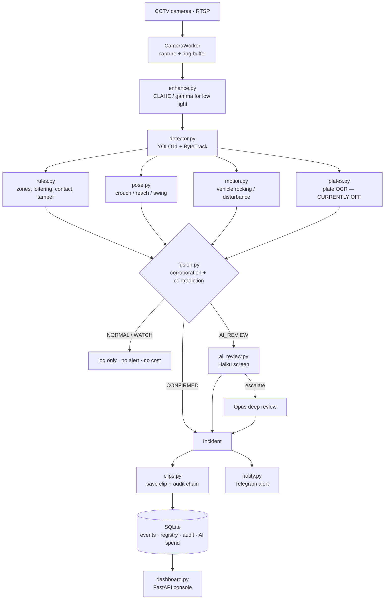

# VisionGuard — Master System Document

**AI security for society CCTV.** Catches vehicle theft, break-ins and vandalism
on the cheap cameras a building already owns.

Last updated: 2026-07-29 · Repo: `AryamanTandon19/Bitsat-tracker-` (branch `main`)

---

## 0. Read this first — the three facts that matter

1. **Plate reading is switched off.** Both OCR packages are commented out in
   `requirements.txt`. Every plate-dependent feature — vehicle registry, known
   vs unknown vehicle, visitor log, journey tracking — cannot work until this
   is enabled. It is the #1 task.
2. **You cannot measure anything yet.** `validate_triggers.py` is a working
   evaluation harness, but `testset/clips/` is empty. Until it has labelled
   clips, every accuracy claim is a guess an investor can puncture in one
   question.
3. **Severity is a hardcoded lookup table, not a judgement.** That is why every
   alert is MEDIUM. It is a bug, not a tuning problem.

---

## 1. Mainframe — what the system is and how it works

### 1.1 The one-paragraph version

Cameras stream into a box that sits **inside the building**. A free computer
vision layer watches every frame and flags candidate moments. A fusion layer
demands corroboration from independent signals before believing anything. Only
what survives both is sent to Claude for a paid opinion. Confirmed incidents
become a Telegram alert with a clip. **Footage never leaves the building** —
only alerts do.

### 1.2 The three layers

| Layer | What it does | Cost | Status |
|---|---|---|---|
| **1 — Free detection** | YOLO11 + ByteTrack find people/vehicles; rules, pose and motion flag candidate moments | ₹0 | Working, over-fires |
| **2 — Fusion** | Requires independent corroboration; downgrades on contradiction. Emits NORMAL / WATCH / AI_REVIEW / CONFIRMED_INCIDENT | ₹0 | Built, **not gating cost** |
| **3 — AI review** | Claude Haiku screens → Opus escalates. Two-tier to control spend | ₹1.30–6.50 per review | Working |

The economic thesis: **layer 3 must almost never run.** Continuous AI viewing
costs ~₹11.5 lakh/month for 4 cameras (measured, §6). The current design costs
~₹3,000–9,400/month. The goal of every upgrade below is to push more decisions
down into layers 1 and 2.

### 1.3 Blueprint



### 1.4 File map

| File | Responsibility |
|---|---|
| `app/main.py` | Entrypoint. One worker + pipeline per camera, plus the dashboard |
| `app/camera.py` | RTSP/file capture, reconnect, frame ring buffer |
| `app/enhance.py` | Low-light enhancement (CLAHE, gamma) — makes dark footage detectable |
| `app/detector.py` | YOLO11 detection + ByteTrack IDs; draws annotations |
| `app/rules.py` | Event types and the **static severity table** (see §3.1) |
| `app/trigger.py` | Candidate triggers: NEAR_VEHICLE, AT_VEHICLE, BREAK_IN, DEPARTURE |
| `app/pose.py` | Pose signals — crouching, reaching, arm swing |
| `app/motion.py` | Vehicle disturbance — a parked car rocking or being struck |
| `app/fusion.py` | Evidence fusion → NORMAL / WATCH / AI_REVIEW / CONFIRMED_INCIDENT |
| `app/hybrid.py`, `app/specialist.py` | R3D-18 specialist models (**disabled**; weights not shipped) |
| `app/ai_review.py` | Two-tier Claude reviewer (Haiku → Opus), daily spend cap |
| `app/vlm.py` | Claude vision client used by the Forensic Lab |
| `app/analyze.py` | Upload-and-analyse pipeline; annotated H.264 video; incident merging |
| `app/clips.py` | Clip saving, keyframe sampling, audited deletion |
| `app/db.py` | SQLite: events, vehicle registry, audit chain, AI cost |
| `app/plates.py` | Plate normalisation + fuzzy match (**OCR backend off**) |
| `app/notify.py` | Telegram alerts |
| `app/dashboard.py` | FastAPI app + the entire single-page console (`PAGE`) |
| `config.yaml` | Every tunable setting |
| `validate_triggers.py` | Evaluation harness — recall + fire-rate (**no data yet**) |
| `app/train.py` | The labelling workbench at `/train` — timeline flags, tagging, tracking |
| `app/tagging.py` | Click-to-select geometry: display pixels → the object under them |
| `app/segment.py` | Single-frame instance segmentation (yolo11n-seg), separate from the live detector |
| `app/annotations.py` | Saved annotations: both polygons, review status, COCO export |
| `app/track.py` | Following one object through moving video, and admitting when it lost it |
| `evaluate_detector.py` | Measures the **live** detector against the labels people made in `/train` |
| `zones.py` | Draw zone polygons on a camera view |
| `verify_audit.py` | Verify the tamper-evident audit chain |

**First measurement from that loop** (MEVA G424 car park, one followed person plus
8 cars on one frame, `yolo11n.pt` at conf 0.35): **100% recall on cars, 44% on
people.** Every person in the set is 40–80px. That is the argument for a bigger
model or a lower confidence floor on person class, and it did not exist before
the workbench could produce it. Caveat printed by the harness itself: 94% of
those labels come from one followed object, so it measures that person at that
distance, not the camera in general.

### 1.4b Training the module on public footage

| Tool | What it does |
|---|---|
| `prelabel.py` | A big slow model (`yolo11m-seg` @1280, conf 0.12) proposes outlines as **drafts**; a person corrects and approves them in `/train`. 1423 proposals across 9 clips in ~60s. |
| `sweep_detector.py` | Runs many detector configs over the *same* frames and prints recall by object size against seconds/frame. |
| `export_yolo_dataset.py` | Approved annotations → YOLO dataset, **split by clip** (never by frame — frames of one tracked object are near-duplicates and random splitting inflates validation). |
| `app/measure.py` | The one matching rule, shared by both harnesses so they cannot disagree. |

**Do the config sweep before any training.** Measured on 52 pre-labelled MEVA frames:

| configuration | recall | s/frame | 40–80px objects |
|---|---|---|---|
| yolo11n @640 conf0.35 *(production)* | 47.8% | 0.04 | **6%** |
| yolo11n @1280 conf0.15 | 69.1% | 0.11 | 40% |
| yolo11s @1280 conf0.15 | **79.8%** | 0.27 | **63%** |

+32 points of recall for 6.3× the inference time, and on the size band where
people live it is 6% → 63%. That is a config change, not a training run. It is
**not applied** — 0.27 s/frame is ~3.5 fps on one CPU camera, so it is a real
trade against how many cameras one box can watch.

**The finding that matters most.** Night footage of the same camera
(`--hours night --spread` now fetches it; 2018-03-11 23:55, mean brightness 30
vs ~110 by day). Across 9 frames, with the pipeline's own low-light
enhancement applied (raises mean to 88):

* daylight, same camera: strong model 332 objects (220 cars, 72 people), production 143
* **night: strong model 10 objects — classed `bench`, `cow`, `fire hydrant`. Production 0.**

Those classes are a model fitting sensor noise, not seeing a car park. Whether
the lot was also empty needs a human to label it, which is exactly why night
clips must be in the test set. But a product whose premise is overnight
vehicle security cannot be evaluated on daylight alone, and nothing measured
so far says it works after dark.

### 1.5 Where it runs

| Environment | URL / entry | Purpose | State |
|---|---|---|---|
| **Railway** | `visionguard-production.up.railway.app` | Live investor demo | **Frozen — do not touch** |
| **Vercel** | `visionguard-prototype.vercel.app` | Static mock, no backend | Fix or retire (§7.3) |
| **Local Windows** | `start_watchdog.bat` | Real deployment | Working |
| **Docker** | `Dockerfile` | Container for any host | Working |

---

## 2. Timeline — where this started, where it is now

**Phase 1 — Free layer.** YOLO detection, ByteTrack, zone/loitering/contact
rules, low-light enhancement, Telegram alerts, SQLite + audit chain.

**Phase 2 — Hybrid.** Specialist R3D-18 models and `fusion.py` corroboration
logic added, wired into the live pipeline. Specialists ship disabled (no
weights).

**Phase 3 — AI review.** Two-tier Claude reviewer with per-camera daily spend
caps and a cost meter.

**Phase 4 — Product surface (this session).** Frontend imported from Lovable,
restyled to the Paper & Ink design, login gate, trimmed to three pages,
deployed to Railway, and a long sequence of container bugs found and fixed.

**Today the system is:** a working prototype, live on the internet, that
performs genuine detection and genuine AI review on uploaded footage — with
three known structural gaps (§0) and demo-grade security (§8).

---

## 3. What we found today (diagnosis)

### 3.1 Everything is MEDIUM — a real bug

`app/rules.py` lines 24–31 assign severity from a **constant lookup table**:

```python
LOITERING:           "MEDIUM"
VEHICLE_CONTACT:     "MEDIUM"
SUSPICIOUS_ACTIVITY: "MEDIUM"
```

A 0.4-second pass-by and a 40-second crouch at a car door receive the identical
label. A smarter path exists (`analyze.py:437` maps fusion decisions to
HIGH/MEDIUM/suppress) but it only activates when the specialist models are
enabled — and they are `false` in config. So everything falls through to the
static table.

### 3.2 Fusion doesn't control AI spend

`fusion.py` is well-designed and already emits the right decisions. But in the
upload path, `analyze.py:251` calls `_ai_review()` on the **whole clip**
whenever the checkbox is ticked — fusion never gates it.

### 3.3 No ground truth

`validate_triggers.py` measures recall and fire-rate correctly.
`testset/clips/` contains **zero clips**; `labels.csv` has only example rows.

### 3.4 Plate OCR disabled

```
# fast-plate-ocr>=0.3.0
# easyocr==1.7.2
```

Runtime confirms: `no OCR backend available — plates will read as unreadable`.

### 3.5 PoseCap is not usable

Evaluated `CorridorTech/PoseCap` (Apache-2.0). Requires **CUDA GPU**, runs
**inside Blender**, is **single-person**, has **no temporal smoothing**, and
outputs SMPL-X — vastly heavier than needed. Rejected. Worth borrowing only as
an *idea*: decoupling GPU inference behind a socket, if a shared GPU box is ever
added.

---

## 4. Changes shipped today

All on `main`. Railway currently runs `4e89fa3`.

| # | Commit | Change |
|---|---|---|
| 1 | `3c2e5da` | Imported the frontend into `frontend/`, isolated from the Python backend |
| 2 | `9a51605` | Restyled the served console to Paper & Ink; added the login gate |
| 3 | `999cb3f` | Trimmed to View / Forensic Lab / Events; removed AI-spend, vehicles, all emoji |
| 4 | `75f50c4` | Served the prototype at `/`; added Vercel config |
| 5 | `42dd267` | Dockerfile + one-command Oracle deploy script |
| 6 | `589d51d` | Honour `$PORT` for managed hosts |
| 7 | `05a68f9` | Disabled the HTTP Basic popup (double login) |
| 8 | `680bca8` | Subtle prototype notice on the login screen |
| 9 | `cf87f9b` | Cloud profile: no dead cameras, no popup, honest empty states |
| 10 | `e8b2e98` | **Fixed uploads:** pinned `lap` (ByteTrack), pre-baked YOLO weights |
| 11 | `7fedafd` | Stopped the preview faking analysis of uploaded footage |
| 12 | `06999bb` | Serve only the real console; `no-store`; added `/health` |
| 13 | `75e85bc` | **Fixed AI review:** installed the `anthropic` SDK; honest error reasons |
| 14 | `1c02cc9` | `/health` reports AI readiness + build marker |
| 15 | `4e89fa3` | Green **ALL CLEAR** banner with equal weight to a threat alert |

**Infrastructure lessons learned:**
- Railway's *Redeploy* replays the same image; it does **not** fetch new commits.
- Disconnecting the GitHub repo **deletes existing deployments**.
- Verify any deploy at `/health` — it echoes `BUILD` and AI-review status.

---

## 5. The product strategy — our USP

### 5.1 The reframe

False alarms come from **missing context**, not a weak model. The system asks
*"is a person near a vehicle?"* — a universal rule, so it fires universally. It
should ask: **"has this ever happened here, at this hour, in this spot, by
someone like this?"**

### 5.2 Learned Normalcy

The system learns *this building's* normal in ~2 weeks, then stays silent unless
something is genuinely new. Components, all CPU-cheap:

1. **Spatio-temporal occupancy** — per grid cell × hour, learn P(person present)
   and typical dwell. A few KB per camera.
2. **Track-level scoring** — score the whole track (dwell, crouch duration,
   approach speed, contact, did the car move after), not each frame. *This is
   the single biggest fix.*
3. **Trajectory prototypes** — learn normal paths; "approached a car and
   stopped" is the deviation.
4. **Familiarity signature** — coarse clothing-colour + height ratio.
   **Non-biometric.**
5. **Vehicle-state memory** — parked car + person + rocking = near-certain tamper.

### 5.3 The slot-ownership map

Point at a parking slot in the camera view, tag it, done:

| Slot | Plate | Flat |
|---|---|---|
| B-12 | WB 02 AK 9931 | 302 |

Then: registered plate in its own slot → silent. Unregistered car in B-12, or a
stranger lingering at a slot → **that is a justified HIGH**.

`zones.py` already draws polygons on a camera view — the setup UI pattern
exists. This extends it to labelled slots with metadata.

### 5.4 "Your car left its spot" — the strongest single feature

Slot occupied → empty is trivial geometry, zero AI cost. Push to the owner:
*"Your car left slot B-12 at 02:14. Was this you?"* One tap.

This converts the hardest AI problem — *is this theft?* — into a question
answered by **the one person with perfect knowledge**. At night, alert the guard
immediately rather than waiting for a reply.

### 5.5 Damage attribution

You cannot see a scratch on CCTV. You **can** detect the event that caused it
(`motion.py` already detects vehicle disturbance) and keep the clip.

**Damage lookup:** owner reports a dent → system searches every contact event at
that slot during the parked period → returns ranked clips. Hit-and-run in
society parking is common and currently unresolvable. This sells itself.

### 5.6 Visitor log — the wedge

Every society keeps a paper gate register: illegible, never audited, useless
afterwards. Once OCR is on, it maintains itself — entry, exit, duration,
searchable, tamper-evident, with overstay flags.

**Sell this first.** "AI catches thieves" is scary and unproven to a secretary.
"Your gate register maintains itself" is obvious, immediate value — and it
generates exactly the data the security features need.

### 5.7 Staff churn — make it unsupervised

Nobody registers anyone. Infer role from pattern: **auto-promote** a signature
seen 5+ days at consistent hours; **auto-expire** after 2 weeks unseen; classify
by route shape (staff vs delivery). Churn handles itself. Keep manual
registration only for **vehicles**, which change rarely.

### 5.8 Why this compounds — the moat

Every guard tap of *real / false alarm* is a labelled example **for that site**.
Consequences:

- False-alarm rate drops every week at each site
- **AI cost falls with customer tenure — unit economics improve with age**
- A competitor with generic thresholds cannot copy it; it is data you own

**AI becomes the teacher, not the runtime.** Heavy in month 1, rare by month 6.

---

## 6. Cost model (computed, current pricing)

Claude Haiku 4.5 $1/$5 per MTok · Claude Opus 4.8 $5/$25 · ₹90/$ · 10 frames/review

**Per review:** 720p → Haiku **₹1.30**, Opus **₹6.52**. 480p → **₹0.57 / ₹2.83**.
*Frame size is the biggest single cost lever (~3×).*

**If Claude watched everything (per camera/day):**

| Sampling | Per camera/day | 4 cameras/month |
|---|---|---|
| 1 frame/sec | ₹9,555 | ₹11.5 lakh |
| 1 frame/10s | ₹956 | ₹1.15 lakh |

**Current architecture (4 cameras):**

| Load | Per month |
|---|---|
| Quiet — 10 events/cam/day | **₹3,129** |
| Busy — 30 events/cam/day | **₹9,388** |
| At the 100/cam/day cap | ₹31,294 |

**Pitch line:** *"Running a frontier model on live CCTV costs ~₹11.5 lakh/month
per building. We do it for ₹3,000 — because our free layer decides what is worth
looking at."* ~300× reduction, and it is architecture, not marketing.

**Levers already in `config.yaml`:** `max_frames`, frame resolution,
`schedule: night_only` (~4×), `escalate: false`, `daily_cap_per_camera`.

---

## 7. The plan — priority ordered

### Priority 1 — Enable plate OCR ⛔ blocks everything
Add `fast-plate-ocr` (lighter than easyocr, better on CPU). Unblocks the
registry, visitor log, known-vs-unknown vehicle, circling detection and journey
tracking. **Effect:** the whole vehicle-identity USP becomes possible.
*Nothing else in §5 works without this.*

### Priority 2 — Labelled evaluation set 👤 your task
30–50 clips into `testset/clips/` + `labels.csv`: ~10 incidents, ~30–40 normal
(residents parking, deliveries, kids, night, rain, glare). Sources: your
society's DVR (this conversation *is* your first pilot conversation) and
UCF-Crime — the harness already parses its annotation format.
**Effect:** turns every claim below from a hypothesis into a number.

### ~~Priority 3 — Visitor log~~ ✅ SHIPPED
`vehicle_visits` table; a plate crossing a gate camera opens a visit, the next
pass closes it. Crossings are deduplicated per tracked vehicle *and* by time.
Residents carry owner/flat through from the registry; unregistered vehicles
still inside past `visitor_log.overstay_hours` are surfaced separately.
API: `/api/visits`, `/api/visits/open`, `/api/visits/overstays`.
**Effect:** the wedge feature. Sells without needing anyone to believe in AI.

### ~~Priority 4 — Slot map + departure notification~~ ✅ SHIPPED
`app/slots.py` + `parking_slots` / `slot_activity` tables. A slot is a drawn
polygon with a label, optionally assigned to a plate and flat. `SlotTracker`
holds occupancy per camera and reports three things: a space taken, a space
vacated, and a vehicle in an assigned space that does not belong there.

The engineering that matters is the hysteresis, not the geometry. A tracker
drops a parked car for a few frames constantly — someone walks in front of it,
the exposure shifts — and announcing "your car has left" on that would get the
notifications muted within a day. Nothing is believed until it has held for
`vacate_confirm_s` (25s default), and startup adopts whatever is already parked
silently rather than announcing every resident's car as a fresh arrival.

The departure message goes to that owner alone. Nobody else needs to know when
a neighbour comes and goes, and a system that tells them is a surveillance
complaint waiting to happen.

API: `/api/slots` (GET/POST/DELETE, drawing needs the registry permission),
`/api/slots/activity` — which is what answers "when did my car leave?" months
later.
**Effect:** the highest-value security feature at near-zero AI cost.

### ~~Priority 5 — Track-level scoring layer~~ ✅ SHIPPED
`app/scoring.py`. Every rule still fires; a firing is now scored 0–1 from the
hour, dwell, registry match, vehicle contact, zone and — crucially — what the
guards at *that site* have been saying about that alert. Below `dismiss` it is
never raised. Thresholds, weights and per-type bases all live in `config.yaml`,
so a noisy site is calmed without a release, and `scoring.enabled: false`
restores the old table exactly.

Every score carries its reasoning in words, stored on the event and shown in
the operator app — an alert that cannot say why it fired is one guards learn
to ignore.

**Measured** (`python compare_scoring.py`, 15 written scenarios — *not*
footage): alerts on everyday situations 9 → 4, incidents missed 0 → 0, and the
five real incidents all moved to HIGH. Turning that into a real number is
exactly what Priority 2 is for.

### Priority 6 — Security hardening ⛔ before any pilot — PART DONE
**Done:** operator accounts and server-side sessions. scrypt password hashing
(stdlib, memory-hard); only the SHA-256 of a session token is stored, so a
copy of the database grants nobody a session; httpOnly + SameSite=Lax cookie;
12-hour expiry that slides while a shift is active; sessions die when an
account is disabled or its password changes. Three roles — guard (triage,
gate), committee (+ notices), admin (+ registry, accounts) — enforced
server-side, with the UI hiding what an account may not use. First run
generates one admin password rather than shipping a default. Every sign-in and
account change lands in the tamper-evident audit chain; no password ever does.
Accounts are managed with `python -m app.users`.
**Still to do:** HTTPS/Tailscale for the camera LAN, secrets out of
`config.yaml`, rate-limiting on `/api/login`, retention policy. See §8.

### Priority 7 — Feedback loop — PART DONE
**Done:** `POST /api/events/{id}/feedback` and the one-tap real / false-alarm
control in the operator app, attributed to the signed-in account. `/api/events`
carries the latest verdict so two guards do not work the same alert.
**Still to do:** the same tap on the Telegram alert itself, and feeding the
collected labels into Priority 5's scoring thresholds.

### Priority 8 — Learned Normalcy
Occupancy maps, trajectory prototypes, familiarity signatures, unsupervised role
inference. **Effect:** the long-term "we barely need AI" endgame.

### Priority 9 — Damage lookup
Search contact events at a slot over a period; return ranked clips; before/after
stills. **Effect:** resolves hit-and-run disputes — a strong differentiator.

---

## 8. Security

**The architecture is an advantage** — on-premise, footage never leaves. But the
current build is **demo-grade, not deployment-grade.**

### What is weak today
- The login is a **demo gate**: credentials in the JavaScript bundle, session in
  `localStorage`. Fine for investors, **not for a society.**
- Server-side HTTP Basic auth is disabled.
- The Railway instance is **publicly on the internet**.
- Camera RTSP passwords sit in plaintext in `config.yaml`.

### Before any pilot
1. **Never port-forward.** Remote access via **Tailscale/WireGuard** only. This
   single decision removes most of the attack surface — exposed CCTV/web ports
   are the leading cause of footage leaks worldwide.
2. **Real auth** — server-side sessions, argon2/bcrypt hashing, rate-limited login.
3. **HTTPS on the LAN** so credentials are not plaintext on society WiFi.
4. **Secrets out of `config.yaml`**; rotate camera passwords off vendor defaults
   (most DVRs ship as admin/admin — check on every install).

### Soon after
5. **Roles** — guard sees alerts; admin sees config; resident sees only their vehicle.
6. **Encryption at rest** (LUKS) — a stolen box must not equal leaked footage.
7. **Retention + auto-delete** (e.g. 30 days) — DPDP data minimisation and a
   smaller breach radius.
8. **Extend the audit chain** — defence against an insider deleting evidence.

### Privacy stance — a sales asset
**No face recognition, no biometrics stored.** At parking distance faces are
20–40 px and recognition fails, and India's DPDP Act treats biometric data as
sensitive — explicit consent, security obligations, breach liability. Use plate
+ slot + non-biometric familiarity instead.

> *"Footage never leaves your building. No biometrics stored. Auto-deleted after
> 30 days. Every deletion is logged and verifiable."*

Answers the committee's objection before they raise it. *(Get real legal advice
on DPDP before deploying — the above is engineering judgement, not counsel.)*

---

## 9. Working agreement

- **Railway is frozen.** No deploys, no config changes — investors are viewing it.
- All work happens on a **GitHub branch**, tested **locally**, until explicitly
  released.
- Verify any future deploy at `/health` (`BUILD` + `ai_review.available`).
- **Rotate the exposed Anthropic API key** — it appeared in a screenshot and must
  be considered compromised.

---

## 10. Honest limits — do not overclaim

- **"100× accuracy" is not a claimable number.** The credible claim, once
  measured, is *"same recall, 80–90% fewer false alarms."*
- **Nothing is measured yet.** Priority 2 is what makes any number defensible.
- **Learned Normalcy has a cold start** — the first 1–2 weeks at a site are noisy.
- **The specialist models ship disabled** — no weights. The system runs on the
  free layer plus Claude today.
- **The Vercel page is a scripted mock**, not the product. Fix or retire it
  before a customer sees it.
